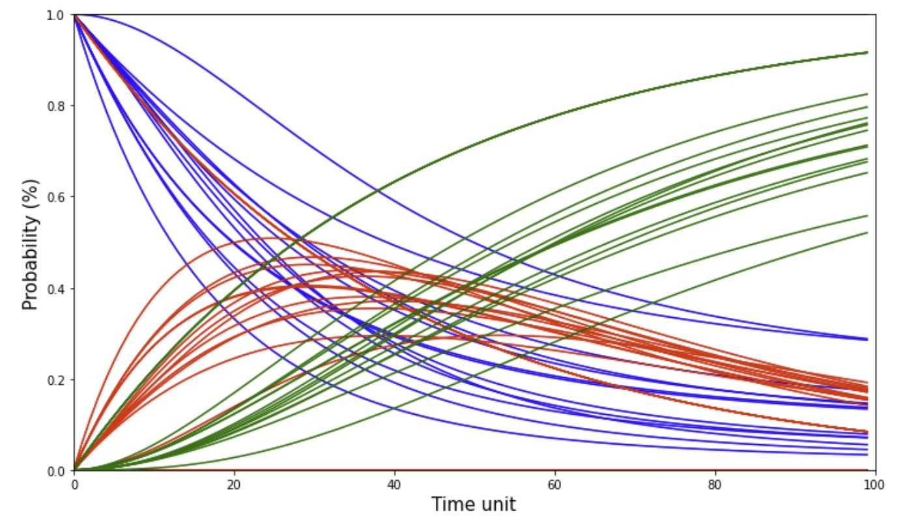
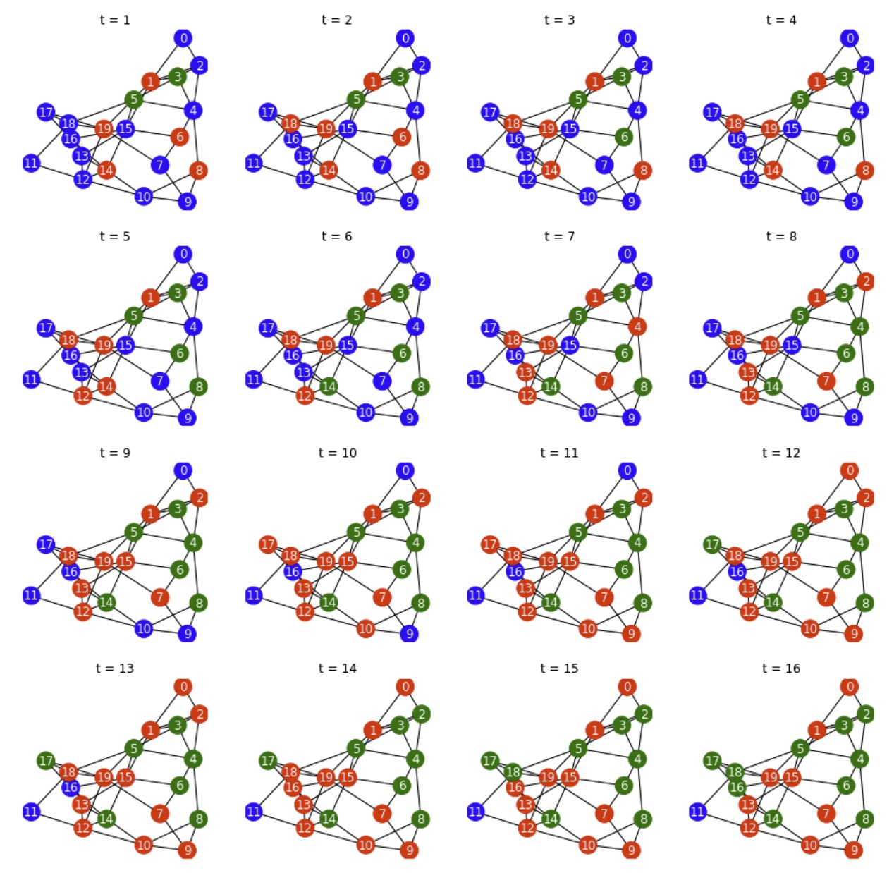

# Brief

This package is designed to analyze the network diffusion, including epidemic spreading. COVID19 has been contaminating human society for a long time and causing countless loss in many industries. The process of the network diffusion can be described mathematically under a set of ordinary differential equations. In our package, the total number of states can be customized by yourself.

Predict the spread of a disease is crucial to all of us because no one can work well without good health. In order to analyze the epidemic, the spreading can be split into the following states so that mathematical model can be built up accordingly:

1. S - Susceptable
2. I - Infected
3. R - Recovered

This is also called SIR model. Sometimes, the model can be even more easier containing only S and I states so that the mathematical mechanism can be better understood. The famous SIR model can not only be applied on the total number of a group of people, but also be able to be implemented to a network composed of nodes and edges. To represent each person by one node and define the relationship between 2 people as the edge connected to the 2 nodes, we can model the society mathematically. A certain epidemic is spreaded throughout the social network from those infected people. By calculating the probabilistic states, i.e:

+ $s_i(t)\to$ probability that node i is `susceptible` at time t 
+ $x_i(t)\to$ probability that node i is `infected` at time t
+ $r_i(t)\to$ probability that node i is `recovered` at time t

along with the coefficients such that:
+ $\beta\to$ individual transmission / infection rate
+ $\gamma\to$ recovery rate

We will be capable of tracking the state of each node along the time line. Combining with the undirected graph structure, which is also called a network, the original simple SIR model is transformed from deteministic to probabilistic description.


# Requirements

This package is developed based on the following dependencies:

+ cdlib
+ networkx
+ numpy
+ scipy
+ matplotlib
+ tqdm

p.s. The programming language should be `Python3`.


# The Reproduction Rate

There is a famous factor $R_0$, which is also called: basic reproduction nnumber. This factor indicates the average number of people being infected by an infected person. If $R_0 > 1$, it means that the disease will keep spreading in the society. On the other hand, if $R_0 < 1$, it implies that the infected population will converge and the disease will not spread persistently. 

| Disease    | -            | Transmission     | -        | $R_0$  |
| ---------- | ------------ | ---------------- | -------- | ------ |
| Measles    | 麻疹         | Airborne         | 空气传播 | 12～18 |
| Pertussis  | 百日咳       | Airborne droplet | 空气飞沫 | 12~17  |
| Diptheria  | 白喉         | Saliva           | 唾液     | 6~7    |
| Smallpox   | 天花         | Social Contact   | 社交接触 | 5~7    |
| Polio      | 小儿麻痹     | Fecal-oral route | 粪口     | 5~7    |
| Rubelia    | 风疹         | Airborne droplet | 空气飞沫 | 5~7    |
| Mumps      | 流行性腮腺炎 | Airborne droplet | 空气飞沫 | 4~7    |
| HIV / AIDS | 艾滋病       | Sexual contact   | 性传播   | 2~5    |
| SARS       | 非典型肺炎   | Airborne droplet | 空气飞沫 | 2～5   |


# SIR Model: S $\to$ I $\to$ R

In a node level SIR model, we assume that the recovered nodes will never get the disease again. The ODE set is formulated as follows:

$$ \begin{cases} \cfrac{ds_i(t)}{dt} = -\beta s_i(t)\sum_j A_{ij} x_j(t)
\\
\cfrac{dx_i(t)}{dt} = \beta s_i(t)\sum_j A_{ij} x_j(t) - \gamma x_i(t)
\\
\cfrac{dr_i(t)}{dt} = \gamma x_i(t) \end{cases}
\\
x_i(t) + s_i(t) + r_i(t) = 1 $$

The adjacent matrix (A) describe the network architecture so that the S nodes can only be contaminated when they have infected neighbors. If there is a connection between 2 nodes, the value would be 1. Otherwise, it would be 0 such that:

```pyth
A = array([[0, 1, 1, 0, 0, 0, 0, 0, 0, 0, 0, 0, 0, 0, 0, 0, 0, 0, 0, 0],
           [1, 0, 1, 1, 0, 0, 0, 0, 0, 0, 0, 0, 0, 0, 0, 1, 0, 0, 0, 1],
           [1, 1, 0, 1, 1, 0, 0, 0, 0, 0, 0, 0, 0, 0, 0, 0, 0, 0, 0, 0],
           [0, 1, 1, 0, 1, 1, 0, 0, 0, 0, 0, 0, 0, 0, 0, 0, 0, 0, 0, 0],
           [0, 0, 1, 1, 0, 1, 1, 0, 1, 0, 0, 0, 0, 0, 0, 0, 0, 0, 0, 0],
           [0, 0, 0, 1, 1, 0, 0, 0, 0, 0, 0, 0, 0, 0, 0, 1, 0, 0, 1, 0],
           [0, 0, 0, 0, 1, 0, 0, 1, 0, 0, 0, 0, 0, 0, 0, 1, 0, 0, 0, 0],
           [0, 0, 0, 0, 0, 0, 1, 0, 0, 1, 0, 0, 0, 0, 0, 0, 0, 0, 0, 1],
           [0, 0, 0, 0, 1, 0, 0, 0, 0, 1, 1, 0, 0, 0, 0, 0, 0, 0, 0, 0],
           [0, 0, 0, 0, 0, 0, 0, 1, 1, 0, 1, 0, 0, 0, 0, 0, 0, 0, 0, 0],
           [0, 0, 0, 0, 0, 0, 0, 0, 1, 1, 0, 0, 1, 0, 1, 0, 0, 0, 0, 0],
           [0, 0, 0, 0, 0, 0, 0, 0, 0, 0, 0, 0, 1, 0, 0, 0, 0, 0, 1, 0],
           [0, 0, 0, 0, 0, 0, 0, 0, 0, 0, 1, 1, 0, 1, 1, 0, 0, 0, 0, 1],
           [0, 0, 0, 0, 0, 0, 0, 0, 0, 0, 0, 0, 1, 0, 1, 1, 0, 0, 1, 0],
           [0, 0, 0, 0, 0, 0, 0, 0, 0, 0, 1, 0, 1, 1, 0, 1, 1, 0, 0, 0],
           [0, 1, 0, 0, 0, 1, 1, 0, 0, 0, 0, 0, 0, 1, 1, 0, 1, 0, 0, 0],
           [0, 0, 0, 0, 0, 0, 0, 0, 0, 0, 0, 0, 0, 0, 1, 1, 0, 1, 1, 0],
           [0, 0, 0, 0, 0, 0, 0, 0, 0, 0, 0, 0, 0, 0, 0, 0, 1, 0, 1, 1],
           [0, 0, 0, 0, 0, 1, 0, 0, 0, 0, 0, 1, 0, 1, 0, 0, 1, 1, 0, 1],
           [0, 1, 0, 0, 0, 0, 0, 1, 0, 0, 0, 0, 1, 0, 0, 0, 0, 1, 1, 0]],
          dtype=int64)
```


# Construct SIR Model with Python Code

The ODE set should be defined in a class inherited from `DifferentialEquation` class. There are 2 important parts:

1. `__init__` method to initialize the probabilities with respect to different states.
2. `derivative` method to formulate ODE.

```pyth
class SIR(equations.DifferentialEquation):
    def __init__(self, A, I0, R0, beta, gamma):
        # numpy 2D Adjacent matrix
        self.A = A
        self.N = len(A)

        # Randomly assign the non-repeated infected and recovered nodes.
        idx = np.random.choice(np.arange(self.N), I0 + R0, replace=False)
        self.I0 = np.zeros((self.N,))
        self.R0 = np.zeros((self.N,))
        self.I0[idx[:I0]] = 1
        self.R0[idx[I0:I0 + R0]] = 1

        # Init matrix should be stacked into a 1D array.
        self.initial = np.hstack([1 - self.I0 - self.R0,    # s(t)
                                  self.I0,                  # i(t)
                                  self.R0])                 # r(t)
        self.beta = beta
        self.gamma = gamma
        self.reproduction_num = beta / gamma    # Definition of "R_0".

    def derivative(self, z, t):
        # The initial "z" starts from "self.initial".
        b = self.beta * z[0:self.N] * np.dot(self.A, z[self.N:2 * self.N])
        r = self.gamma * z[self.N:2 * self.N]
        return np.hstack([-b, b - r, r])
```

If we have 10 nodes in a network, `self.initial` attribute would be a vector with length $10\times \#state$, which is 30 in SIR case. Mind that there are 2 parameters that must be defined here:

1. `self.A` for saving the adjacent matrix.
2. `self.N` for saving the total number of node, which is equal to `len(self.A)`.


# Network Simulation

As the ODE set is well defined in a class, the simulation can be executed by applying `EpiModel` class. Except for the dependencies, there are some functions that should be imported first.

```python
from epidemic import EpiModel
from utils.plot import draw_probs, get_neighbor
```

In addition, ODE is solved by a given time period. A timeline should also be generated here.

```python
days = np.arange(0, 10, 0.1)
```

### 1. Generate a Network

```pyth
# G = nx.watts_strogatz_graph(num_node, 5, 0.4)     # Small world
# G = nx.powerlaw_cluster_graph(num_node, 5, 0.4)   # Power law
G = nx.gnp_random_graph(num_node, 0.08)             # Random
```

### 2. Initialization

```python
# Note --> SIR  params: I0, R0, beta, gamma
epi = EpiModel(G, SIR, num_state=3, params=[4, 2, 0.4, 0.2])
```

### 3. Simulate

```pytho
s, i, r = epi.simulate(days)
```

The function will help you get the probability with respect to each time interval. 



### 4. State Propagation

So far, we only get the probabilities of each state for all nodes. However, the deterministic state of each node at time t remains unknown. Although the trend of the probabilities can guide the transformation of each node, we still need to define the sequence first. In SIR case, S will be turned into I and I will be turned into R.

```pytho
epi.set_propagate(0, 1, neighbor=1, update_state=False)
epi.set_propagate(1, 2, neighbor=None, update_state=False)
status, _ = epi.propagation()
```

`set_propagate` method has 4 parameters (from, to, neighbor, update_state). If SIR is defined properly, 012 will represent SIR respectively and the setup should be done by the number. `neighbor` means that the state transition will happen only when the neighbor of the node has `neighbor` kind of neighbor. S will be infected only when it has $1\rightarrow infected$ neighbors. As for the parameter `update_state`, it is used to deal with the split state transition. If one state can be transformed into 2 states, it should follow a sequence. The state that is transformed later should turn it into `True`.

Finally, the network simulation can be visualized by applying the following function.

```python
epi.visualize(status, np.arange(16), figsize=(15, 15), n_row=4, n_col=4)
```




# Citation

Impact of Vaccination Strategies for Epidemic Node-level SVIR Probabilistic Model. 2020. CL Kuo, MX Chen, Victor, Chan.


# License

Copyright (c) 2020, Kuo Chun-Lin
All rights reserved.

Redistribution and use in source and binary forms, with or without
modification, are permitted provided that the following conditions are met:

* Redistributions of source code must retain the above copyright notice, this
  list of conditions and the following disclaimer.

* Redistributions in binary form must reproduce the above copyright notice,
  this list of conditions and the following disclaimer in the documentation
  and/or other materials provided with the distribution.

THIS SOFTWARE IS PROVIDED BY THE COPYRIGHT HOLDERS AND CONTRIBUTORS "AS IS"
AND ANY EXPRESS OR IMPLIED WARRANTIES, INCLUDING, BUT NOT LIMITED TO, THE
IMPLIED WARRANTIES OF MERCHANTABILITY AND FITNESS FOR A PARTICULAR PURPOSE ARE
DISCLAIMED. IN NO EVENT SHALL THE COPYRIGHT HOLDER OR CONTRIBUTORS BE LIABLE
FOR ANY DIRECT, INDIRECT, INCIDENTAL, SPECIAL, EXEMPLARY, OR CONSEQUENTIAL
DAMAGES (INCLUDING, BUT NOT LIMITED TO, PROCUREMENT OF SUBSTITUTE GOODS OR
SERVICES; LOSS OF USE, DATA, OR PROFITS; OR BUSINESS INTERRUPTION) HOWEVER
CAUSED AND ON ANY THEORY OF LIABILITY, WHETHER IN CONTRACT, STRICT LIABILITY,
OR TORT (INCLUDING NEGLIGENCE OR OTHERWISE) ARISING IN ANY WAY OUT OF THE USE
OF THIS SOFTWARE, EVEN IF ADVISED OF THE POSSIBILITY OF SUCH DAMAGE.